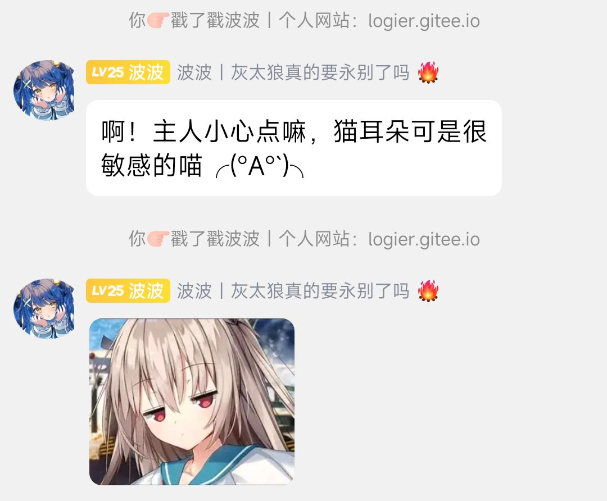
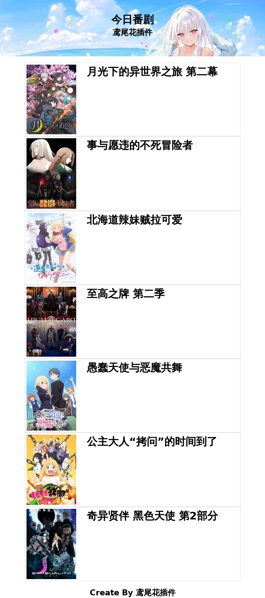
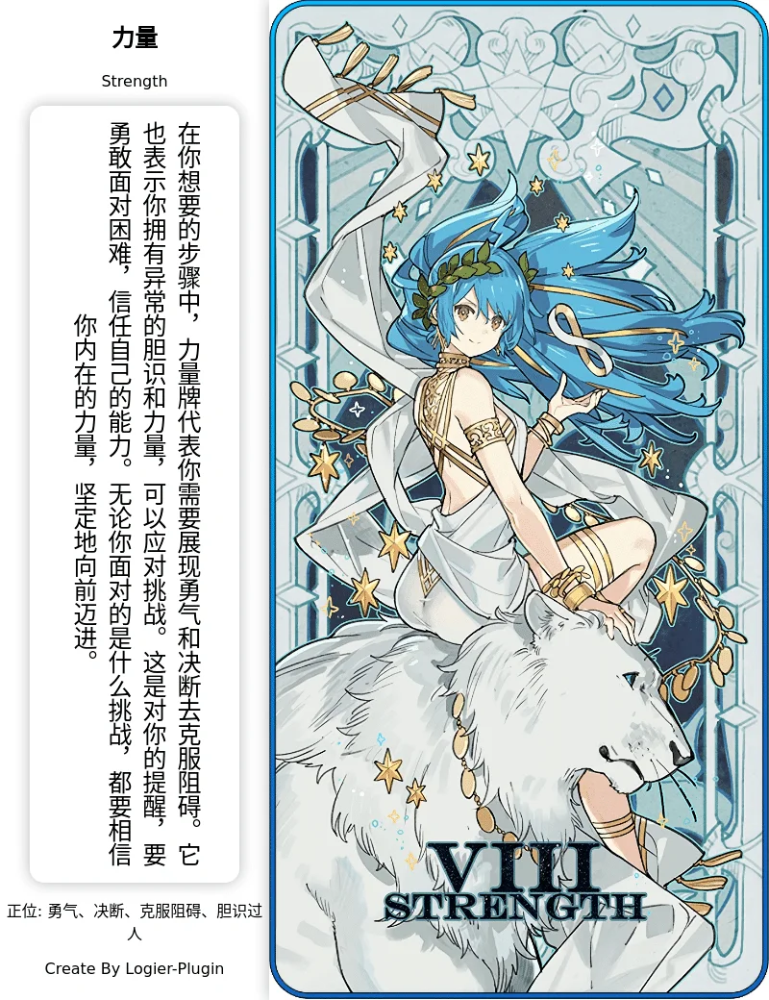
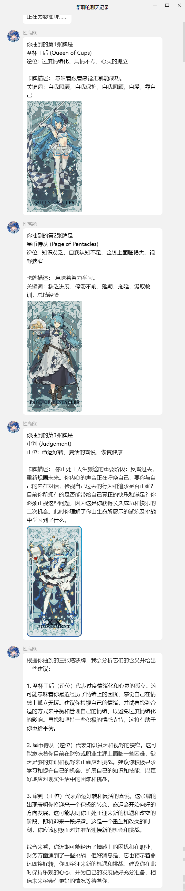
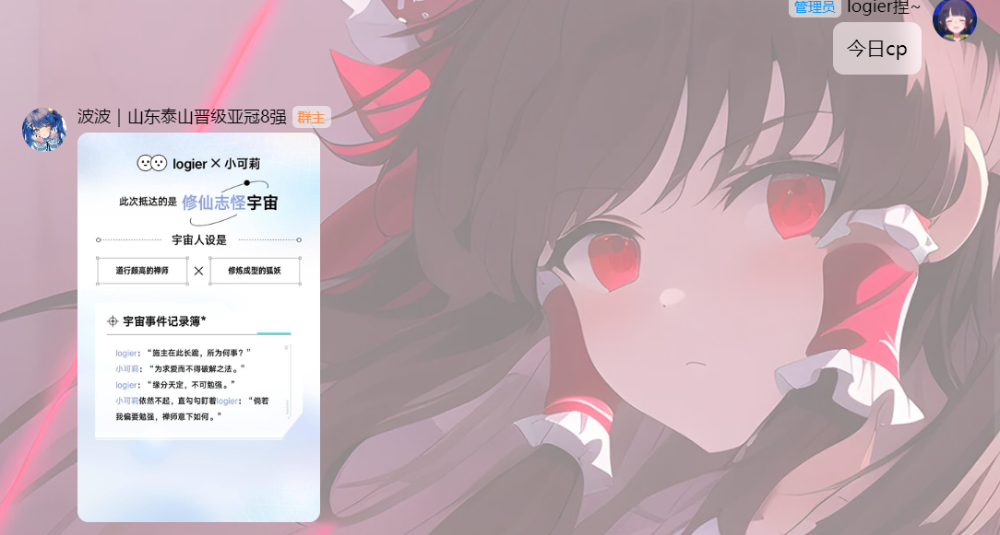
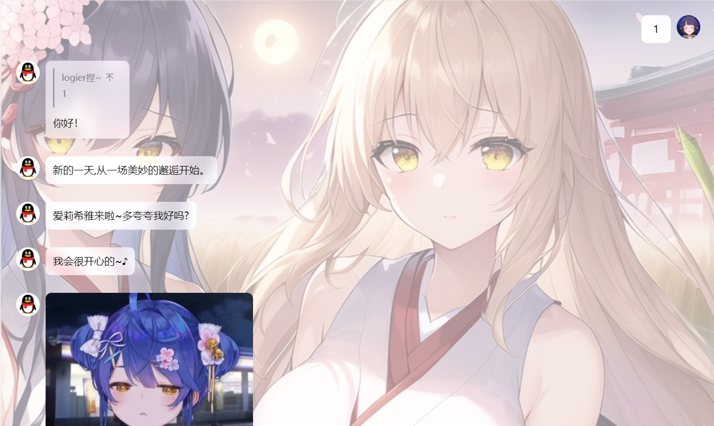
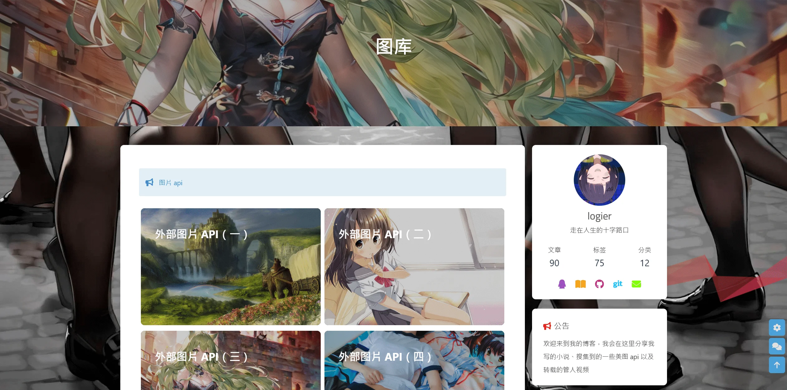

# 鸢尾花插件(logier-plugin)

<div align="center">
  <a href="https://logier.gitee.io/">
    
  </a>
<br>

 [](https://qm.qq.com/cgi-bin/qm/qr?k=Tx0KJBxwamQ1slXC4d3ZVhSigQ9MiCmJ&jump_from=webapi&authKey=BJVVNjuciQCnetGahh3pNOirLULs1XA7fQMn/LlPWAWk5GDdr2WWB/zHim1k1OoY) &nbsp; [](https://logier.gitee.io/) &nbsp;[![Group](https://img.shields.io/badge/表情包仓库-blue?style=flat&labelColor=white&logo=data:image/png;base64,iVBORw0KGgoAAAANSUhEUgAAACEAAAAgCAYAAACcuBHKAAAAAXNSR0IArs4c6QAAB59JREFUWEfNlmmMXlUZx3/nnLu820xnpZ3SBWunrBIblBqWBFkDCUUTZakEooh+IEHUhEVBhABKIiCaQKiGFNRUpDJ+qQKKaZEqpmBkF2rptJ12psssnXmXu5x7HnPvoLEU2k794klu3jfve+45v/M/z/95HsX/wVD/K4OIlIAAEKChlHIzXfOIIN54YfLM4a07vzu0bdfZY6N10gQ8E9LZ3f5i3zGdP7vwyv6HZgIyI4g/Dmy557WX37wlbQGpgcxDrI9NFYFfISwHNOMxIjdG34L2gRP7j/3CaZfOz2cfdBw2xKr7XpCdg6MEup2kKfgqpOSHeNrgUshSD6c0xhMwEVbVyXR9rHdu7e6rbz7r/oNRHBbEL3+8Ud59e4SK14VLPbQE2NhRKYXE0T5KfhlFhahlybIML1CoICGjQaobUwv7u7962deXrf4wkENCvLFucmDtwPOfCaQDG2uMBPgmAOewNsJ4ESKCdmU8U0Ohcfl/zuJUTFjVjEfDT9/yyPILjxjisXs3yN5tCdqW8HQJsULoB0xOTtDWXsZKs4BQLkDj4TIgf4zG+JrYNvEqKZWj0su/dOu5T3wQyEGVyO137/VrW4HtxWQBnhhSGxfXEMV1vMAnldybmnwhLa54pt2qEEWhiF8V6jL00E0/uvy6GUOMviufe+zBdU+atBeVZPjGQ1yGMVJAKM/HqVIRkJoMRYKR/NOBaEQpjBfQtBM0GV5/28oVZ80YYvurjWufWPnSylyJrJkSBh5KCYLFuhjxPDIp5xqgSVAqfg/GgfMBD8GQqgambZKv3XfBByp/0OsY32y/+JP7/vRoyfXhoghPK5RSZJJRxCaatNgMtEoLJTRpAaVciEiulEfCJLoyzjcfPAIIGZNZP7xz/YSJevAkAydkudJ5IAYa6zKUMqg8DpQtVMjRlBgkV0gCnPbITB3Ke/nG/efOXIk8MB+9fWNrfIdQ8XVx4szmAafB87HW4qMLAIWdDsi8dLwH4XK3IEjYpHue4+qblx0RRLju8ZHopef/SWCy6eyYp2rjkymvsKLvPEyhRH4NFlSGU7laPpkGZ4SEMU45Yz7nXHFCRSl1QBo/lEVrwy9x/a9/seFuF6cYDFYEMXlAWrQK8JMKunBkhOi4gMgt6wgRFCkxplrnqmvPo3uR9wkVqJff75BDZkyZlGvuv3XtT33XVsic6Yx3Bt9kx6636ZuzkP6jT8UnP/U+Nm95nT17R+jqmkv/omWFGsZPSNQubvzeJaiKmtl1iEgXLZ7E0njort9fbOtlms2EoKoZ+O1qXDBOEjtWLL8Bl2qCcsSvnlpFnNQphx1cfOGX8XSVJG1Q7Yq57rZPg7NQ9TqUUvv+W40PVUKsjK9Z9WzHy+s3QTyLuV3HonWAMwnPrhtgItpGrdbOOadeipEQzBTr//wMjeYYszp6WXbKRSipYYxh5+63CWdNcMrpi7jk0vNfMzV18mFB2ClxD9zzuHplw2YWzj6J2R2LQDycl5KZJtt2v0H/osW4ejsGH+saONVkbHyYzs5eAtODzXziOGWquYdXN63j9HNO5sY7r0KF+1/LfkqISDcZT+FYiqWtMUzjB3c8WZ0aTVg8/yTSZDo/lKqGXeNDhGFI4CqInU5iflnTiiaK74oSWhm0UWwZ2kRbD9z8nRWUuiAW3vKqfNvz1ECuyH4QLhFZs/o5hraOoaISzYmUfTubBNRYcPQS4sgWvncqQwWgtGCcRkThMo0xisw28H0PyQubCM5lDI0M4rwWHXPa6JnbQ2QazFnQzmUrzvSUUtn+SiQiN93wANGUQcUhRD6hqtLb0Se+riitfLRnijKd2Aid5wFJMMYniSEMfTLbpFYp02pFZImjVquxe3SEejLBvmgU6zkyv8m8xbO44/tfKfbfHyIWmdoDf3hmI3u21XGRz4LZixnaMoKNpTgxWmElwWFRfgYmIcs7OimTZXlLI0jqCHRYpPQsTTCB8NHj5rFj91asb5mzsIszzvvYRM981XkARP6DRJKnuGk8CwMr32HH1lGSxFEqlYiTKRwJQUVxzJLZLF12AvP6PUY2w3PPvM7ObbvRWYhHtejAbFJH+02WnDiH8688zmIRKkUDdpwqqc0HKpGIjA5PMrhpBNes8tar2xndmeB7NZpTdUwolKtCKx3louVncfynuvOCCYYrpMXqPJP/Y6PlN2uepax7iBqOWilEezFxuoeuvjKfPG0pk60x+j7S/feFJ3UvPRAiFbnrWw8jcRvt4UJsowyuSpZaqu0+rWQXnb0Zn19xtrTPxtHObKXU6L89LyJ5W5HtHhTWrvkr48MOF5XRefDoCM+3NJJ9KD+hvddw3e3LPyAmrMjPH/kdWzdPQNROaLpx1uAHGqfrLDvzeM4476gpfJ5TJfXZD2tcJZFVWK7e8PQ4f/vLJpqTLTo6q0zVx/PgQfkxnb0lrrnp/AMhomYqOvV48flX2D44ijjNkiVLigX6Pz4rKqp2oPJW6rCGxCJ5pX3nlQnG9g4zuPVd0B5d3e1ccNlp/zHFAWlb8jKZ96p5AE13KRkGwSPP+fFh7f6+SWLlCgwvKKW2z6jHzAuYUmrsSDad6TuHLOUzXfBI5v8L2D+lTuNzgMgAAAAASUVORK5CYII=&logoColor=black)](https://gitee.com/logier/emojihub/) &nbsp; <a href='https://gitee.com/logier/logier-plugins/stargazers'></img></a> &nbsp; [![爱发电](https://img.shields.io/badge/爱发电-blue?style=flat&labelColor=white&logo=data:image/png;base64,iVBORw0KGgoAAAANSUhEUgAAAFAAAABQCAMAAAC5zwKfAAAC9FBMVEUAAACabOutif+ve/+FbLiVcuaQaOCWb+WYceiLYtuccOingvOYcOeRad6ZcuifeumXcOWhfO6jfPCmhPOUa+aLYtyac+iVbuSMZN2VbeWNZt6RaeGRauKhee2acumQauClfvGTa+OOZd6JYNqWb+Sog/SSauGPaOCogvSNZN2NZN2ngfKogvSngPOfeu6bdemTauSlfvGYcOiohPSngfKQaOCXb+aifO+XcOaVbuWTbOOogfOlf/GmgPKTbOOYceaMZN2pg/WQaN+hee2OZt6RaeCRauGKYtuSa9+bdOmog/SifO+ddumie+6Zcuelf/GSa+Ked+uYcealf/GSauGJYdqpg/SQaOCJYduOZd6jffCJX9qNZN6mgfKMZN2SauKfeOyKYtuXcOWpg/SngfOdduuJYNqQaN+WbuWUbeWmgfOLY9yUbOWlf/GZceeKYNqOaN6mgvKpgvSZceiMZNyVb+WNZt2cdumSauOfee2Wb+WPaN+geu2ddeqMZNypg/Wheu6lf/GZcueJYNmQaN+jffCTbOSphPWog/SWb+WmgPKWb+aYcuekf/Gac+iKYtuVbuWWbuSogvSSa+KWb+SOZt6ifO+feeyngfKRaeGpg/SYcOefeOujfe+VbeSMZd6ac+iJYdqVbeSog/OVbOWcdeqKYtungvObdOmfd+uSa+KNZNyeduuRaeGjfe+XcOWMY9ybdOmngvSOZt6UbuWacuiSbOKgee2bdOmMY9yVbuOmgvSUbeKviP6xif+UaueVa+mMY92ZcOyqhPaOZOKuh/2shPybcu2mf/WhePKcdO6ddeyYb+qZceirhPmpgfmedfCacuuWbuWogfemffefdfKacuqSaOaPZeSRaOKyiv+qg/iogvShd/SYbuyWbeiQZuWNZN+MYt+thvqlffSie/CXbeqTaOeKYdu1jP+jevOccvCbce6Xbeuth/uqgvukevinf/eiePaVau2WbOqXb+ahdvuUaumfdPehee+thP6bb/MemaUsAAAAvXRSTlMAAwEEAwb+/Qv6Cfv8IRAOXiwaFP7++9p3TkwvJSEeGf7++/r59+ri0MmCeFZCPjk3NDEk9PHi4NLIwq2djHp1bmNZUVBIPzwU/v38+fj49/bz6+rl5N7a0s7Hw8LAvq+opqSjlZOSiIBuaGRjYmJaVU1HREQ1KykW+/X19O7r6OXf29vV0c3Mxry4taupnpqZlZGRi4uGgXxzbWtjWlJG8/Px7ezk3dfQwbq4tp2Zh3t6cVxaVtrXz7GdcGlhNM13AAAH1ElEQVRYw+1YVVgbQRDezd2RkODu7pS6u7u7u7u7u7u7u7slkCZESUKCuxQoLVD3vnSPSyW9S6ClD33o/xHOdv6b2f1nZhPwH//xz4EFcRwi/CU2RKY/hayK0+EYdWhr6eGN6CrKCEk6qzZNtwxY0Wtxr8EtK8qIob+Zo/v6i7Ozk8U54jeFMwFeoaUAcMIA/2RxrjhZ6O9v7n/szWjA+nMXkWWbAbni3Nzk3BXDhvUSmpsnZ08BsCJ8E/yTC8XCXqPbzHbpa24u/ODoUpE5hGBKbm6h44ApELj1TRLnvMm50IYUDoQ4UiWGQJBAB/IfXuaLcDB3RXLhsdFbwtyHfXjiKDa/51aWIKBJmRJgilBYOLXpmyfm2ULznNCWsHTRWZDgWLX1tvRwr9p6ZquWU5sjtDwyy9LqW0axjEd8NTm7Lwj7UohWw9Hx9OCBoQMHDx44MLRfv5V9goMX11qwwM8MISUlxcysVtDK8zsmuhOkHW40ZJds8WkOMUyY9CQ7R5jyITIp6UmkHlFRUW8RCkpKSjIzM2MyMwsKYmKyuq4e05owSokBN0ehGC3rkS39FvulILIoPSIjfZFXfgtq1QoK6hkcHNwzqFZX35ji4pismGLf+g/bIlsWY8jc0CeO5jfQKWf2zOZNXcLG7Nq1a0xY2NV9TSfcmOp2pHVV99keHpZeXmg+W0/dt61+z6yiGJ1U6tyEg6wZXWyVkyMUhnHLm6aWh7c5a6U6raLuYdKaBpRjTZPEwshQUi5IbKVxsCgZYjRQLrW9uU4n1SlU962QYBlTxS/KL8nsghundBIIAofMFQ6SiqFIW63TJrIz6s5CNximEbQJjUryi0rpN6aVN/USjMAgi17hWHoZkiSTaycEJMy/xTSRLBxwXYJLIs0iM836DGnsZknoXcIxXJ8WLETnbeNOMeqvvTbKLbSJBxiXhhzustKhxME361GBWc/6l/a18uB89w2WumTjHFt7zo86CdFbxypVKsUBetR64Vu1vNTHLKsgqyDz0aMs36DVQ3aMc61qyaUmpfoGrSrx9WFA/Jy1YLJTYjulDWBKROqmVevGQ/p0dXiEEEN+fLsGrd7qygXWY+cr2FrpcA6Ahia3nNopnWYAjLnrUYOtZk3ccf72cZ20qKiY5E2Q1h9XL0P3LsHZ5tfpghDYKJ3kpzwBZrwvU2dzq9qMHV7f+WSAtIiti03QshMCdralTT+pwibPnOIvskxUeCQ04ttT69kzXHfOfxcQoIpdVwUtHaPkNsd3jL8G8LLKrte4nY1noGnnbmWz32V0PwCRUpiLi/XZZ8pu1QFmui1UdU5QKLS1m9jUTmArFBs9qNLCzFi5ozJ+qMkuhAOi3ssAaaxOoZCi/Ko9mZx+E014VN4n5CJhqi3MOa7S1a3HZltYSJXDLUk3TI5elB+/x9SGCANzl8cmbtj2jm2R0d2Gthj0cjU079U5DEBTvfpKLFulstDKN3jS3aO//2B+3lKkRVNREHVjLSwyOjdBEwrL7sTVFubNq2yCED2Z3F1l8bouqb3ybBW8lsryWwBonA9FnJiYMdyKWtyyPbSvI8s7BKBRPtbm1xZKVZPSelIuQrulr3yMeggB3Piys7y7K6llDC/X7sh24asOEVT2MSYn4ltuC6haDcuzXW2RH9fDFh2ZdX/ttZP8rBdyD/F5o/jL4eHuuBerrAHO/LZZnZWxy70AQTKNPTlkbhl1BEKk6P4aSUPmYBDJqJftjlYBBMnt7vDx/TiTwqH8r9JJFjeJeRwOrO/K5aNK8xICb+f3Dq4GA1m/9lZgd7kR3C3RLLMHXMaIUaLLlS3QkSpiW28alCVIZq5hGjd8KhlUJ12y3p756xIOKjvJj1YH8Ec8LMP4DOseIkztEifz8emybKQnumQgnNHu2SIkmW8zDg348Mb1Jv7isl3/p+k+6XFxaYIelRgYMVCl47OOVQDOLA/XovcOyH0DnzmNaqplXWQSXnTaJADphJ6nnuUfREdmwuKPBoQQWI/cZGsfUdk2YlMaj3+iBs0QAuJcfN5QNNuMEmEZhozMw58+7bHXljw/xEt/3gxg9ETZE/+pWzVaWWBeFByMT+epU3khjabVaFZTpKYTohu23fLjLwIjjCxDbSDzQfzA9qJoQfuaj3kCKmSayagX817tZmCkawZZT6qZns4TCdSP+aJUwX4AGavlHc082Z6yaj/VusJFoseBlaaP6B3YPnANKRvmxr1Q1kkz1A6dYkZLTWml9Gwg4Imej0eX9tUiqhHGej0E0zppOr2oc5BL2jF2W0h6Z319SWpgtGg8GvRjQ2ikJFau87mDTNN/vJ1+rw5Z3wEhTrIBu/0hAjXv6ZJpiB6ZYGiQqW/4nps0cR1exNW53MLu+034IxGtp4/szee35/Mb1ChXHyNjOLRKkybTSHyWNQifXoPz0zP7as0anuHxo0XR/JBKtD2UiU7KmdS/g0SSlqZW+/QIWd+wUfj1B+F7t48Y1DvwMf/5Y75AtKYZlxxYTpCBwIjtq7pI+BK1WhLN50cj8AUCRBYtSBX1HjENI0f99k85EXsbnKmZxhcgJgSBIDVVIFqydnslO0qIZYIuDlJjlcJHNhi0NiRkzdr1Ixrtn16Dq9f1HwD/bga5HGuOPh1pkv9NPw3FDXHyukKgRIhTH1Q9/uM//nl8BYlod8WjsBdLAAAAAElFTkSuQmCC&logoColor=black)](https://afdian.net/a/logier)

 
</div>
<br>

***如果发现bug，希望及时Q群告知我或提交issue***
***如果喜欢本插件，就点点star吧***

## 更新日志 💡

### **24.02.26 更新潜伏模板，群聊中收到消息后概率GPT回复并发送表情包，对俗手哥拙劣的模仿**
### **24.02.23 破坏性更新，修复了更新后配置项丢失的问题，以及启动插件缺失yaml文件的问题，更新后需要重新配置，谨慎更新**

## 安装教程 ✨


Yunzai-Bot目录下执行(二者选其一)

gitee
```
git clone --depth=1 https://gitee.com/logier/logier-plugins.git ./plugins/logier-plugin/
```
github
```
git clone --depth=1 https://github.com/logier/logier-plugins.git ./plugins/logier-plugin/
```

## 插件功能 👓

- 发送 **#鸢尾花帮助** 获取插件详细信息

- 推荐使用[锅巴插件](https://gitee.com/guoba-yunzai/guoba-plugin)进行配置

<br>


| 名称 | 指令 | 名称 | 指令 |
|-------|------ |-------|------ |
| 表情包仓库 | #表情包 | 表情包小偷 | 发送消息随机触发 |
| 戳一戳表情 | 戳一戳触发 | 保存表情包 | #存(表情\|涩图) <br> #查看(表情包\|涩图)+序号？<br> #删除(表情包\|涩图)+序号  | 
| 定时发图 | 定时推送 | 摸鱼日历 | 定时推送 | 
| 今日新闻 | 定时推送 | 城市天气 | 定时推送 |  
| 今日运势 | #今日运势 #悔签 | cp生成器 | #今日cp | 
| 算一卦 | #算卦 #悔卦 | 塔罗牌 | #塔罗牌 #占卜 #彩虹塔罗牌 | 
| 签到 | #签到 | 番剧 | #今日番剧 |
| 自定义图片api | 自定义指令 | 进退群通知 | 进退群触发 | 
| 问候回复 |  打招呼触发 <br> 例如早安、晚安 | 订阅小说 | #搜小说+轻小说书名 <br> #订阅小说+轻小说书名 <br> #查看订阅小说 |
| 潜伏模板 |  发送消息随机触发 |  |  |
<br>

### 表情包系列

<details> <summary>表情包仓库</summary>

- 可联动**保存表情包**，将保存地址填入自定义表情包地址。
- [表情包仓库源地址](https://gitee.com/logier/emojihub)
- 最新版更新锅巴配置屏蔽部分表情包，如龙图、小黑子，支持分群配置。
- 可配置表情包仓库随机时自定义表情包概率，默认为0

| 指令 | 表情包 | 指令 | 表情包 |
| :----:| :----: | :----:| :----: |
| 表情包仓库 | 全随机 | 自定义表情包 | 自定义表情包 |
| 阿夸 |  | 阿尼亚 |  |
| 白圣女 |  | 柴郡 |  |
| 甘城猫猫 |  | 狗妈 |  |
| chiikawa |  | 龙图 |  |
| capoo |  | 小黑子 |  |
| 亚托莉 |  | 真寻 |  |
| 七濑胡桃 |  | 小狐狸 |  |
| 喵内 |  | 波奇 |  |
| 心海 |  |  |  |
</details>
<br>

<details> <summary>表情包小偷</summary>

- 配置群号，当群里有人发表情包时，会记录到数据库。
- 配置概率，当配置群里有人发消息时，会概率把之前记录的表情包发送。
</details>
<br>

<details> <summary>戳一戳表情包</summary>

- 戳一戳发送表情包，配置和**表情包仓库**共用。
- 配置概率，默认为0，全部用表情包回复，提高会概率用GPT回复。
- GPT需要配置key，[如何获取key？](#如何获取key)


</details>
<br>

<details> <summary>保存表情包</summary>

- **保存+图片**或**引用图片+保存**即可保存。
- 默认保存路径云崽根目录+/resources/logier/emoji
- 支持保存多张。
- **查看表情包**会返回图片编号
- **查看表情包+编号**会发送此编号的图片
- **删除表情包+编号**会删除此编号的图片
- 支持双路径保存
</details>
<br>

### 定时系列

<details> <summary>定时发图、摸鱼日历、今日新闻</summary>

- [定时发图如何获取图片api？](#如何获取图片api)
- 配置发送时间，采用cron表达式。👉[Cron表达式在线生成器](https://cron.qqe2.com/)
</details>
<br>

<details> <summary>城市天气</summary>

- 配置发送时间，采用cron表达式。👉[Cron表达式在线生成器](https://cron.qqe2.com/)
- 使用和风天气API获得天气信息。[如何获取key？](#如何获取key)


</details>
<br>

<details> <summary>今日番剧</summary>


</details>
<br>

### 运势系列

<details> <summary>今日运势、算一卦</summary>

- [如何获取图片api](#如何获取图片api)


</details>

<br>


<details> <summary>塔罗牌</summary>

- 由AI解析占卜，需要gptkey [如何获取key？](#如何获取key)
- 发送塔罗牌+想占卜的东西即可



- 支持抽三张占卜，发送 占卜+想占卜的东西 即可。
- 注意！三牌占卜会用合并转发形式发送，部分适配器可能不支持。


</details>
<br>


<details> <summary>签到</summary>

- 请使用横图图源 [如何获取图片api？](#如何获取图片api)
- 竖图适配也许做，也许不做。


</details>
<br>

<details> <summary>今日老婆</summary>

- 重复发送marry会看到今天娶了谁。
- 使用图片形式发送，带有一句结婚祝词。
- 可以离婚（
- 离婚一天只能一次。


</details>
<br>

<details> <summary>今日cp</summary>

- 随机抽一个倒霉蛋群友组成cp
- 这个功能测试的时候快被群友昵称的特殊字符整疯了


</details>
<br>

### 小修系列

<details> <summary>进退群通知</summary>

- 修改自官方插件。
- 进群时会发送其头像和一句 俏皮话欢迎。
- 退群时有必要说俏皮话吗？


</details>
<br>

<details> <summary>问候回复</summary>

- 发送早安、中午好、晚上好等词回复。
- GPT回复，需要key，[如何获取key？](#如何获取key)


</details>
<br>


<details> <summary>潜伏模板</summary>


</details>
<br>


## 配置事项 📢

### 如何填入本地图库？
使用图片时，均可以使用本地或者网络图片
本地图片支持图片文件上级目录，也就是如果文件结构如下，可以填写emojihub或capoo-emoji
```
├── emojihub
│   ├── capoo-emoji
│   │   ├── capoo100.gif
│   ├── greyscale-emoji
│   │   ├── greyscale100.gif
支持jpg、jpeg、png、webp、gif
```
寻图逻辑获取文件夹和子文件夹下的所有图片然后随机一张

<br>

### 如何获取key？

- 塔罗牌、问候回复和戳一戳回复需要GPT，可以前往[chatanywhere](https://github.com/chatanywhere/GPT_API_free?tab=readme-ov-file#%E5%A6%82%E4%BD%95%E4%BD%BF%E7%94%A8)免费获得。

<details> <summary>还是不懂？</summary>

1.点击领取内测免费API Key


<br>

2.复制这一串东西填入


</details>
<br>


- 城市天气可以前往[和风天气](https://console.qweather.com/#/apps)免费获得，👉[和风天气官方教程](https://dev.qweather.com/docs/configuration/project-and-key/)
<br>
<br>

### 如何获取图片api

[我的个人博客](https://logier.gitee.io/gallery/)有很多我收集的图片api
<details> <summary>图片api预览</summary>

</details>
<br>


## 作者相关 🎲
- [QQ群](https://qm.qq.com/cgi-bin/qm/qr?k=Tx0KJBxwamQ1slXC4d3ZVhSigQ9MiCmJ&jump_from=webapi&authKey=BJVVNjuciQCnetGahh3pNOirLULs1XA7fQMn/LlPWAWk5GDdr2WWB/zHim1k1OoY)
- [个人博客网站](https://logier.gitee.io/)

## 鸣谢列表 🎁

[爱发电](https://afdian.net/a/logier)


<details> <summary>参考仓库列表</summary>

- [今日运势源仓库](https://github.com/twiyin0/koishi-plugin-jryspro)
- [云崽插件基础示例](https://gitee.com/Zyy955/Miao-Yunzai-plugin)
- [云崽市场](https://gitee.com/yhArcadia/Yunzai-Bot-plugins-indexn)
- [向日葵插件](https://gitee.com/xrk114514/xrk-plugin)
</details>

<details> <summary>赞助人列表</summary>

| 昵称 | 金额 |
| :----:| :----: |
| 悠修 | 10元 |
| 慕蝶 | 5元 |
| Hirasawa Yui | 5元 |
| EF-2000台风 | 50元 |

</details>