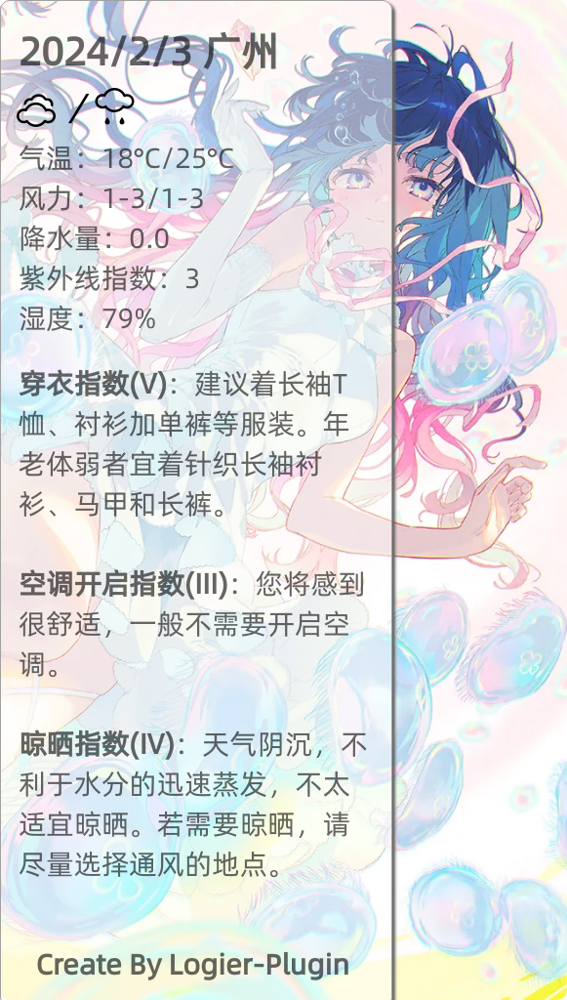
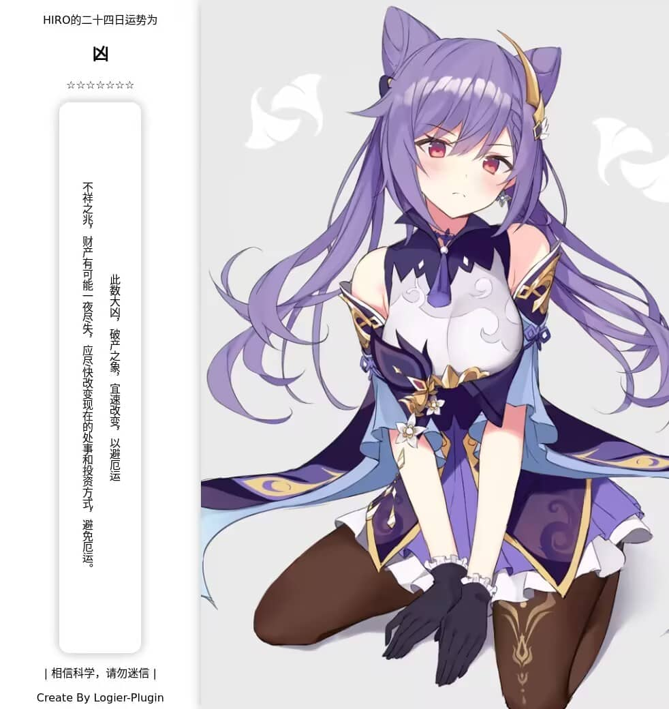
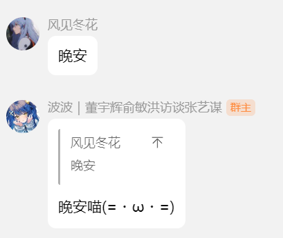
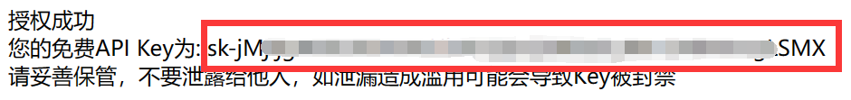

# 鸢尾花插件(logier-plugin)

<div align="center">
  <a href="https://logier.gitee.io/">
    
  </a>
<br>

 [](https://qm.qq.com/cgi-bin/qm/qr?k=Tx0KJBxwamQ1slXC4d3ZVhSigQ9MiCmJ&jump_from=webapi&authKey=BJVVNjuciQCnetGahh3pNOirLULs1XA7fQMn/LlPWAWk5GDdr2WWB/zHim1k1OoY) &nbsp; [](https://logier.gitee.io/) &nbsp;[![Group](https://img.shields.io/badge/表情包仓库-blue?style=flat&labelColor=white&logo=data:image/png;base64,iVBORw0KGgoAAAANSUhEUgAAACEAAAAgCAYAAACcuBHKAAAAAXNSR0IArs4c6QAAB59JREFUWEfNlmmMXlUZx3/nnLu820xnpZ3SBWunrBIblBqWBFkDCUUTZakEooh+IEHUhEVBhABKIiCaQKiGFNRUpDJ+qQKKaZEqpmBkF2rptJ12psssnXmXu5x7HnPvoLEU2k794klu3jfve+45v/M/z/95HsX/wVD/K4OIlIAAEKChlHIzXfOIIN54YfLM4a07vzu0bdfZY6N10gQ8E9LZ3f5i3zGdP7vwyv6HZgIyI4g/Dmy557WX37wlbQGpgcxDrI9NFYFfISwHNOMxIjdG34L2gRP7j/3CaZfOz2cfdBw2xKr7XpCdg6MEup2kKfgqpOSHeNrgUshSD6c0xhMwEVbVyXR9rHdu7e6rbz7r/oNRHBbEL3+8Ud59e4SK14VLPbQE2NhRKYXE0T5KfhlFhahlybIML1CoICGjQaobUwv7u7962deXrf4wkENCvLFucmDtwPOfCaQDG2uMBPgmAOewNsJ4ESKCdmU8U0Ohcfl/zuJUTFjVjEfDT9/yyPILjxjisXs3yN5tCdqW8HQJsULoB0xOTtDWXsZKs4BQLkDj4TIgf4zG+JrYNvEqKZWj0su/dOu5T3wQyEGVyO137/VrW4HtxWQBnhhSGxfXEMV1vMAnldybmnwhLa54pt2qEEWhiF8V6jL00E0/uvy6GUOMviufe+zBdU+atBeVZPjGQ1yGMVJAKM/HqVIRkJoMRYKR/NOBaEQpjBfQtBM0GV5/28oVZ80YYvurjWufWPnSylyJrJkSBh5KCYLFuhjxPDIp5xqgSVAqfg/GgfMBD8GQqgambZKv3XfBByp/0OsY32y/+JP7/vRoyfXhoghPK5RSZJJRxCaatNgMtEoLJTRpAaVciEiulEfCJLoyzjcfPAIIGZNZP7xz/YSJevAkAydkudJ5IAYa6zKUMqg8DpQtVMjRlBgkV0gCnPbITB3Ke/nG/efOXIk8MB+9fWNrfIdQ8XVx4szmAafB87HW4qMLAIWdDsi8dLwH4XK3IEjYpHue4+qblx0RRLju8ZHopef/SWCy6eyYp2rjkymvsKLvPEyhRH4NFlSGU7laPpkGZ4SEMU45Yz7nXHFCRSl1QBo/lEVrwy9x/a9/seFuF6cYDFYEMXlAWrQK8JMKunBkhOi4gMgt6wgRFCkxplrnqmvPo3uR9wkVqJff75BDZkyZlGvuv3XtT33XVsic6Yx3Bt9kx6636ZuzkP6jT8UnP/U+Nm95nT17R+jqmkv/omWFGsZPSNQubvzeJaiKmtl1iEgXLZ7E0njort9fbOtlms2EoKoZ+O1qXDBOEjtWLL8Bl2qCcsSvnlpFnNQphx1cfOGX8XSVJG1Q7Yq57rZPg7NQ9TqUUvv+W40PVUKsjK9Z9WzHy+s3QTyLuV3HonWAMwnPrhtgItpGrdbOOadeipEQzBTr//wMjeYYszp6WXbKRSipYYxh5+63CWdNcMrpi7jk0vNfMzV18mFB2ClxD9zzuHplw2YWzj6J2R2LQDycl5KZJtt2v0H/osW4ejsGH+saONVkbHyYzs5eAtODzXziOGWquYdXN63j9HNO5sY7r0KF+1/LfkqISDcZT+FYiqWtMUzjB3c8WZ0aTVg8/yTSZDo/lKqGXeNDhGFI4CqInU5iflnTiiaK74oSWhm0UWwZ2kRbD9z8nRWUuiAW3vKqfNvz1ECuyH4QLhFZs/o5hraOoaISzYmUfTubBNRYcPQS4sgWvncqQwWgtGCcRkThMo0xisw28H0PyQubCM5lDI0M4rwWHXPa6JnbQ2QazFnQzmUrzvSUUtn+SiQiN93wANGUQcUhRD6hqtLb0Se+riitfLRnijKd2Aid5wFJMMYniSEMfTLbpFYp02pFZImjVquxe3SEejLBvmgU6zkyv8m8xbO44/tfKfbfHyIWmdoDf3hmI3u21XGRz4LZixnaMoKNpTgxWmElwWFRfgYmIcs7OimTZXlLI0jqCHRYpPQsTTCB8NHj5rFj91asb5mzsIszzvvYRM981XkARP6DRJKnuGk8CwMr32HH1lGSxFEqlYiTKRwJQUVxzJLZLF12AvP6PUY2w3PPvM7ObbvRWYhHtejAbFJH+02WnDiH8688zmIRKkUDdpwqqc0HKpGIjA5PMrhpBNes8tar2xndmeB7NZpTdUwolKtCKx3louVncfynuvOCCYYrpMXqPJP/Y6PlN2uepax7iBqOWilEezFxuoeuvjKfPG0pk60x+j7S/feFJ3UvPRAiFbnrWw8jcRvt4UJsowyuSpZaqu0+rWQXnb0Zn19xtrTPxtHObKXU6L89LyJ5W5HtHhTWrvkr48MOF5XRefDoCM+3NJJ9KD+hvddw3e3LPyAmrMjPH/kdWzdPQNROaLpx1uAHGqfrLDvzeM4476gpfJ5TJfXZD2tcJZFVWK7e8PQ4f/vLJpqTLTo6q0zVx/PgQfkxnb0lrrnp/AMhomYqOvV48flX2D44ijjNkiVLigX6Pz4rKqp2oPJW6rCGxCJ5pX3nlQnG9g4zuPVd0B5d3e1ccNlp/zHFAWlb8jKZ96p5AE13KRkGwSPP+fFh7f6+SWLlCgwvKKW2z6jHzAuYUmrsSDad6TuHLOUzXfBI5v8L2D+lTuNzgMgAAAAASUVORK5CYII=&logoColor=black)](https://gitee.com/logier/emojihub/) &nbsp; <a href='https://gitee.com/logier/logier-plugins/stargazers'></img></a>

 
</div>
<br>

***如果发现bug，希望及时Q群告知我或提交issue***

## 安装教程

***24.02.04 大幅优化锅巴配置，之前的配置可能不适配，需要重新配置***

Yunzai-Bot目录下执行(二者选其一)

gitee
```
git clone --depth=1 https://gitee.com/logier/logier-plugins.git ./plugins/logier-plugin/
```
github
```
git clone --depth=1 https://github.com/logier/logier-plugins.git ./plugins/logier-plugin/
```

## 功能

发送 **#鸢尾花帮助** 获取插件详细信息

<br>
插件配置很多，但关键配置可通过锅巴配置

| 名称 | 功能 |
|-------|------ |
| 表情包仓库 | 指令触发发送表情包 |
| 表情包小偷 | 记录群友表情包并随机发送 |
| 戳一戳表情 | 戳一戳触发，可接入GPT。 |
| 保存表情包 | 手动保存群友表情包 | 
| 定时发图 | 定时向群里发送相册 |
| 摸鱼日历 | 定时向群里发送摸鱼日历 | 
| 今日新闻 | 定时向群里发送每天60s新闻 | 
| 城市天气 | 定时向群里发送城市天气 | 
| 今日运势 | 算算你的今日运势 | 
| 算一卦 | 给你算一卦 | 
| 塔罗牌 | 抽取塔罗牌，并让GPT占卜 |
| 签到 | 签到涨好感度吧 |
| 进退群通知 | 发送诙谐的进群欢迎 | 
| 问候回复 |  回复打招呼 |
<br>

<details> <summary>表情包仓库</summary>

- 可联动**保存表情包**，将保存地址填入自定义表情包地址。
- [表情包仓库源地址](https://gitee.com/logier/emojihub])
- 配置项可配置屏蔽部分表情包，如龙图、小黑子，支持分群配置,请手动在/config/emojihub.yaml里面编辑。
- 可配置表情包仓库随机时自定义表情包概率，默认为0

| 指令 | 表情包 | 指令 | 表情包 |
| :----:| :----: | :----:| :----: |
| 表情包仓库 | 全随机 | 自定义表情包 | 自定义表情包 |
| 阿夸 |  | 阿尼亚 |  |
| 白圣女 |  | 柴郡 |  |
| 甘城猫猫 |  | 狗妈 |  |
| chiikawa |  | 龙图 |  |
| capoo |  | 小黑子 |  |
| 亚托莉 |  | 真寻 |  |
| 七濑胡桃 |  | 小狐狸 |  |
| 喵内 |  | 波奇 |  |
| 心海 |  |  |  |
</details>
<br>

<details> <summary>表情包小偷</summary>

- 配置群号，当群里有人发表情包时，会记录到数据库。
- 配置概率，当配置群里有人发消息时，会概率把之前记录的表情包发送。
- 因为需要asface参数，目前只支持icqq。
- 后续计划加入随机表情包仓库图片，就不会限定icqq。
</details>
<br>

<details> <summary>戳一戳表情包</summary>

- 戳一戳发送表情包，配置和**表情包仓库**共用。
- 配置概率，默认为0，全部用表情包回复，提高会概率用GPT回复。
- GPT需要配置key，[如何获取key？](#如何获取key)
- 若使用GPT回复，请手动在/config/key.yaml修改人格

</details>
<br>

<details> <summary>保存表情包</summary>

- **保存+图片**或**引用图片+保存**即可保存。
- 默认保存路径云崽根目录+/resources/logier/emoji
- 支持保存多张。
- **查看表情包**会返回图片编号
- **查看表情包+编号**会发送此编号的图片
- **删除表情包+编号**会删除此编号的图片
- 未来也许会会支持多路径保存
</details>
<br>

<details> <summary>定时发图、摸鱼日历、今日新闻</summary>

- [定时发图如何获取图片api？](#如何获取图片api)
- 配置发送时间，采用cron表达式。[如何写Cron表达式？](#cron表达式)
</details>
<br>


<details> <summary>城市天气</summary>

- 配置发送时间，采用cron表达式。[如何写Cron表达式？](#cron表达式)
- 使用和风天气API获得天气信息


</details>
<br>

<details> <summary>今日运势</summary>

- [今日运势图片api](#如何获取图片api)

</details>
<br>

<details> <summary>算一卦</summary>

- [算一卦图片api](#如何获取图片api)

</details>
<br>

<details> <summary>塔罗牌</summary>

- 由AI解析占卜，需要gptkey [如何获取key？](#如何获取key)
- 发送塔罗牌+想占卜的东西即可

</details>
<details> <summary>占卜</summary>

- 支持抽三张占卜，发送 占卜+想占卜的东西 即可。
- 注意！三牌占卜会用合并转发形式发送，部分适配器可能不支持。

</details>
<br>


<details> <summary>签到</summary>

- 请使用横图图源 [如何获取图片api？](#如何获取图片api)
- 竖图适配也许做，也许不做。

</details>
<br>

<details> <summary>进退群通知</summary>

- 修改自官方插件。
- 进群时会发送其头像和一句 俏皮话欢迎。
- 退群时有必要说俏皮话吗？

</details>
<br>

<details> <summary>问候回复</summary>

- 发送早安、中午好、晚上好等词回复。
- GPT回复，需要key，[如何获取key？](#如何获取key)

</details>
<br>

<details> <summary>今日老婆</summary>

- 重复发送marry会看到今天娶了谁。
- 使用图片形式发送，带有一句结婚祝词。
- 可以离婚（
- 离婚一天只能一次。
- 想用相合伞渲染，让两个人的名字在伞下两边，但找不到好的相合伞素材（


</details>
<br>


## 注意

### 如何填入本地图库？
使用图片时，均可以使用本地或者网络图片
本地图片支持图片文件上级目录，也就是如果文件结构如下，可以填写emojihub或capoo-emoji
```
├── emojihub
│   ├── capoo-emoji
│   │   ├── capoo100.gif
│   ├── greyscale-emoji
│   │   ├── greyscale100.gif
支持webp、jpeg、webp、webp、gif
```
寻图逻辑是当前目录下没有图片就随机选择一个文件夹继续搜寻

<br>

### 如何获取key？

塔罗牌、问候回复和戳一戳回复需要GPT，可以前往[chatanywhere](https://github.com/chatanywhere/GPT_API_free?tab=readme-ov-file#%E5%A6%82%E4%BD%95%E4%BD%BF%E7%94%A8)免费获得。

<details> <summary>还是不懂？</summary>

1.点击领取内测免费API Key


<br>

2.复制这一串东西填入


</details>
<br>


城市天气可以前往[和风天气](https://console.qweather.com/#/apps)免费获得，👉[和风天气官方教程](https://dev.qweather.com/docs/configuration/project-and-key/)
<br>
<br>

### 如何获取图片api

本插件自带一个logier严选的pid索引，使用p站反代获取图片，推荐自行更换更稳定的图源，最好本地图源。

[我的个人博客](https://logier.gitee.io/gallery/)有很多我收集的图片api
<details> <summary>图片api预览</summary>

</details>
<br>


### Cron表达式

[在线Cron表达式生成器](https://cron.qqe2.com/)
```
各位代表的意思 *-代表任意值 ？-不指定值，仅日期和星期域支持该字符。 （想了解更多，请自行搜索Cron表达式学习）
    *  *  *  *  *  *
    ┬  ┬  ┬  ┬  ┬  ┬
    │  │  │  │  │  |
    │  │  │  │  │  └ 星期几，取值：0 - 7，其中 0 和 7 都表示是周日
    │  │  │  │  └─── 月份，取值：1 - 12
    │  │  │  └────── 日期，取值：1 - 31
    │  │  └───────── 时，取值：0 - 23
    │  └──────────── 分，取值：0 - 59
    └─────────────── 秒，取值：0 - 59（可选）
```

## 作者
logier
- qq群：[315239849](https://qm.qq.com/cgi-bin/qm/qr?k=Tx0KJBxwamQ1slXC4d3ZVhSigQ9MiCmJ&jump_from=webapi&authKey=BJVVNjuciQCnetGahh3pNOirLULs1XA7fQMn/LlPWAWk5GDdr2WWB/zHim1k1OoY)
- 个人网站：[logier.icu](https://logier.gitee.io/)

## 鸣谢
- [jryspro](https://github.com/twiyin0/koishi-plugin-jryspro)
- [一些基础插件示例~](https://gitee.com/Zyy955/Miao-Yunzai-plugin)
- [Yunzai-Bot 相关内容索引](https://gitee.com/yhArcadia/Yunzai-Bot-plugins-indexn)
- [Xrk-plugin](https://gitee.com/xrk114514/xrk-plugin)